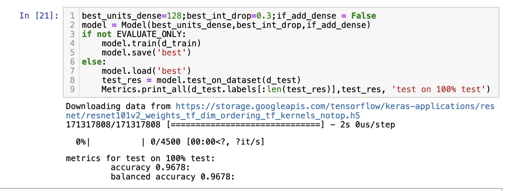
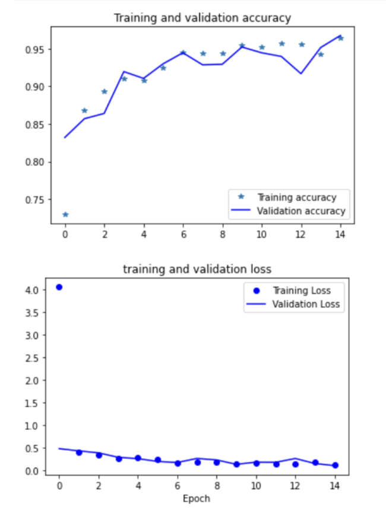
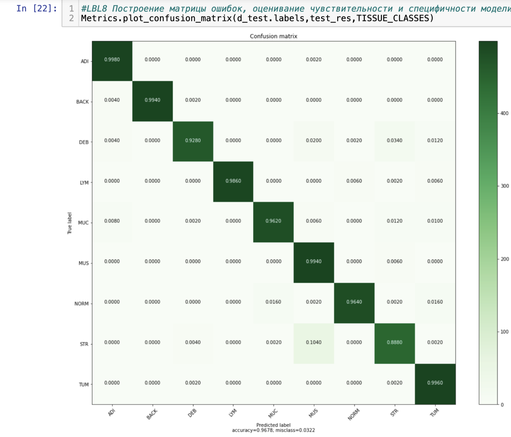

# Практическое задание №1
## Критерии оценивания. Основная часть
Реализация модели классификации, основанной на свёрточных нейронных сетях.

точность ACC на предоставленной тестовой выборке **96.78%**

## Критерии оценивания. Дополнения
1.Валидация модели на части обучающей выборки

3.Автоматическое сохранение модели при обучении

4.Загрузка модели с какой-то конкретной итерации обучения (если используется итеративное обучение)

5.Вывод различных показателей в процессе обучения (например, значение функции потерь на каждой эпохе)

6.Построение графиков, визуализирующих процесс обучения (график зависимости функции потерь от номера эпохи обучения, и т.п.)

7.Автоматическое тестирование на тестовом наборе/наборах данных после каждой эпохи обучения (при использовании итеративного обучения)

8.Построение матрицы ошибок, оценивание чувствительности и специфичности модели

9.Автоматический выбор гиперпараметров модели во время обучения By using Keras-Tuner 

10.Автоматическое сохранение и визуализация результатов тестирования

11.Использование аугментации и других способов синтетического расширения набора данных.

